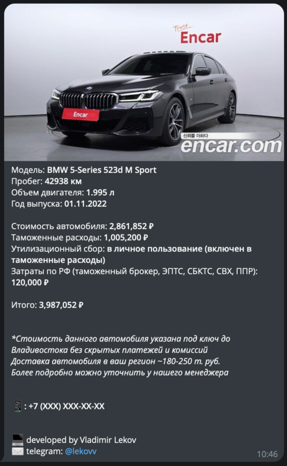

# ENCAR.COM Telegram Bot
<u>English version is below</u>

Реализация телеграм бота, который принимает на вход ссылку на автомобиль с сайта [encar.com](http://www.encar.com/) и возвращает:
* Титульное фото
* Наименование модели
* Год выпуска
* Пробег
* Объем двигателя
* Стоимость, конвертированную сначала из Корейских вон в доллары США и из долларов в Российские рубли
* Расходы на таможню, которые вычисляются по формуле в зависимости от объема двигателя и возраста автомобиля
* Льготный утилизационный сбор, который уже включен в таможенные расходы
* Фиксированные затраты для постановки на учет в РФ
* Итоговая стоимость

_Также, реализована маржинальность 15% от стоимости автомобиля (не итоговой)_



### Технологический стэк:
* Scala ZIO Framework
* Docker, Docker compose
* Selenium (для парсинга html)
* ExchangeRate-Api (для получения актуальных курсов валют)
* bot4s (для интеграции телеграм бота)
* sttp (для http запросов)
* Circe (для парсинга json)

### Чтобы запустить приложение локально:
1) Установите [Docker](https://www.docker.com/) если еще этого не сделали
2) Убедитесь, что вы находитесь в **корневой директории** проекта и выполните команду:
```bash
sbt pack
```
3) Создайте бота в телеграм с помощью `@BotFather`
4) Получите ваш АПИ ключ [ExchangeRate-Api](https://app.exchangerate-api.com/). Вам доступно 1500 запросов в месяц бесплатно
5) Перейдите в директорию `/docker` и создайте в ней файл `.env`
```bash
cd docker
```
6) Наполните файл `.env` вашими переменными окружения:
```dotenv
INTERFACE_HOST=localhost
INTERFACE_PORT=8080
TELEGRAM_CONFIG_TOKEN=ваш токен телеграм
EXCHANGE_RATE_API_CONFIG_TOKEN=ваш АПИ ключ ExchangeRate-Api
```
7) Находясь в директории `/docker`, выполните команду: 
```bash
docker-compose up
```
P.s.: файл `docker-compose.yml` написан для архитектуры _ARM64_. Если у вас другая, ваш файл будет отличаться

8) Вернитесь в телеграм и отправьте боту ссылку на автомобиль с сайта [encar.com](http://www.encar.com/)

---
# ENCAR.COM Telegram Bot

Implementation of a telegram bot that takes a link to a car from [encar.com](http://www.encar.com/) and returns:
* Cover photo
* Model name
* Production date
* Mileage
* Engine capacity
* Cost, first converted from Korean won to US dollars and from dollars to Russian rubles
* Customs expenses, which are calculated using a formula depending on the engine capacity and age of the car
* Preferential recycling fee, which is already included in customs expenses
* Fixed costs for registration in the Russian Federation
* Total cost

_Also, a margin of 15% of the cost of the car (not the total) is implemented_


### Tech stack:
* Scala ZIO Framework
* Docker, Docker compose
* Selenium (for parsing html)
* ExchangeRate-Api (for getting current exchange rates)
* bot4s (for integrating a telegram bot)
* sttp (for http requests)
* Circe (for parsing json)

### To run the application locally:
1) Please install [Docker](https://www.docker.com/) if you don't have it already
2) Make sure you are in the **root directory** of the project and run:
```bash
sbt pack
```
3) Create a bot in telegram using `@BotFather`
4) Get your API key [ExchangeRate-Api](https://app.exchangerate-api.com/). You have 1500 requests per month for free
5) Go to the `/docker` directory and create a `.env` file in it
```bash
cd docker
```
6) Fill the `.env` file with your environment variables:
```dotenv
INTERFACE_HOST=localhost
INTERFACE_PORT=8080
TELEGRAM_CONFIG_TOKEN=your telegram token
EXCHANGE_RATE_API_CONFIG_TOKEN=your API key ExchangeRate-Api
```
7) While in the `/docker` directory, run the command:
```bash
docker-compose up
```
P.s.: the `docker-compose.yml` file is created for the _ARM64_ architecture. If you have another one, your file will be different

8) Go back to Telegram and send the bot a link to the car from [encar.com](http://www.encar.com/)


